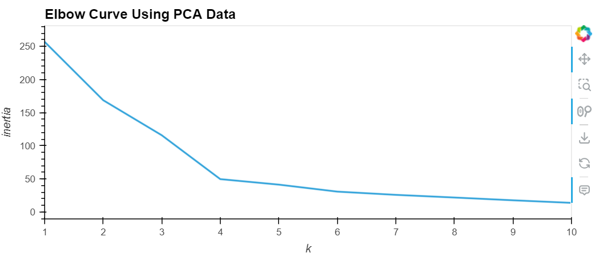
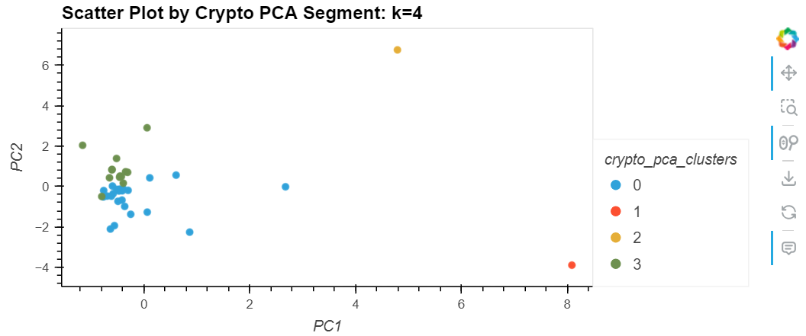
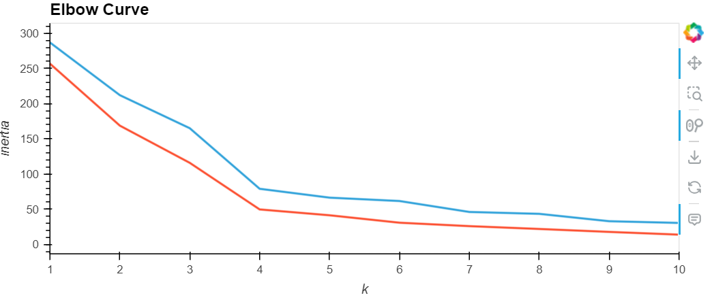
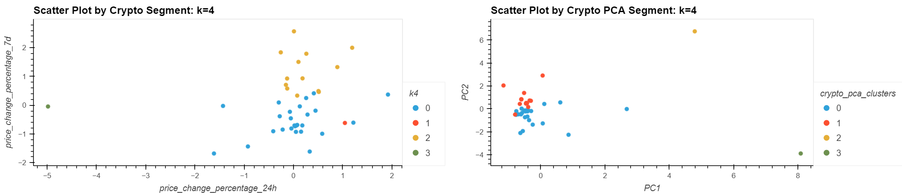

# CryptoClustering - Module 19 Challenge

## Overview
The goal of this challenge was to employ techniques for unsupervised machine learning to find the best values for the given set of data. The objectives were:
1. Find the best k value by using the original data
2. Cluster the cryptocurrencies with K-means by using the original data
3. Optimize clusters with Principal Component Analysis (PCA)
4. Find the best k value by using the PCA data
5. Cluster the cryptocurrencies with K-means by using the PCA data
6. Visualize and compare the results of using the original data vs the PCA data
--------------------------------
## 1. Find the Best Value for k by Using the Original Data
**Synopsis: K values/KMeans is a method of analyzing data by clustering groups of data based on similarities, where k is the number of distinct clusters and each data point is assigned to the closest cluster.**

The first step to analyzing the data was to import the CSV data, get an idea of what the data looks like, and then use the .describe() function to see the summary statistics. The next step was to prepare the data by using the StandardScaler().fit_transform() function on columns containing numerical values (in this project it was all of the price_change_percentage columns). Once the data was scaled, I made a list of k values (range 1-11) and an empty list for storing inertia values. After I initialized the lists, I used a for loop to iterate through each k value and fit a model to it, and stored the data in the inertia list. What this does is segment the data and simplify it to where a simple line chart (elbow curve) can be generated and analyzed to see where the most prominent change (i.e. the elbow) in data is before the line segments flatten and have little to no change. 

In order to create the elbow curve I needed to create a dictionary with the k values and inertia values generated in the for loop and transform it into a dataframe. Using pandas hvplot, I generated the elbow curve where x was the k values and y was the inertia values. For this first elbow curve, seen below in figure 1, the last significant change is at k = 4, which means that it is the best k value for this dataset.

Fig. 1, Elbow curve using original data

---------------------------------
## 2. Cluster the Cryptocurrencies with K-Means by Using the Original Data
The next for step k-means was to cluster k = 4 by using the original scaled data to fit it to a model. The model is defined as having n_clusters = 4 and random_state = 1. Using this model allowed me to predict which cluster each data point would fall in (found in the k4 column of crypto_predictions_df). Once I had the predictions, I used hvplot to create a scatter plot that showed each cryptocoin and which cluster it was predicted to reside in. The scatter plot uses "price_change_percentage_24h" as the x-axis and "price_change_percentage_7d" as the y-axis, and the clusters from the k4 column are shown by color, see figure 2 below.

Fig. 2, Scatter Plot by Crypto Segment: k = 4.

------------------------------
## 3. Optimize the Clusters with Principal Component Analysis
**Synopsis: Principal Component Analysis (PCA) is a method where a large data set is reduced into a smaller set of variables, i.e. the original large set of values, or variables, is condensed to a smaller set of variables that are mixtures of the original variables, but still contain most of the information from the large set. This makes the dataset easier to handle and is faster for machine learning, but does come with the caveat that some accuracy is lost in the process.**

This assignment required using PCA to optimize the clusters and determine if the best k value from a PCA standpoint matches the k value that was determined with the original data. First the pca was assigned n_components = 3, then used the pca.fit_transform() function on the crypto_scaled_df to generate the PCA data. This data was used to find the explained_variance_. The explained_variance_ is what allows a data scientist to determine the amount of variance explained by each of the components. The total_explained_variance that I got was [2.6689967 5.15878002 6.42185214]. To be honest I'm not entirely sure how to interpret or explain this and what it means. I did look it up and I listed references at the bottom, but I need to ask my instructor more about it to understand it better.

---------------------------------
4. Find the Best Value for k by Using the PCA Data
The process for finding the best k value for the PCA data was the same as the first part of the assignment, but using the crypto_pca_df instead of the original data:
  - create a list with k values ranging 1 to 11;
  - create an empty list to store inertia data;
  - utilize a for loop to iterate through the k values and calculate inertia for each one;
  - create a pca_elbow_data dictionary with the k values and inertia data;
  - use the pca_elbow_data to create a df for plotting the elbow curve;
  - use .hvplot.line() to create the elbow curve seen in figure 3.

The elbow curve generated from the PCA data is identical to the elbow curve from the original data in that the "elbow" occurs at k = 4 before the curve stays more flat, see figure 3.

Figure 3, PCA elbow curve.

----------------------
## 5. Cluster the Cryptocurrencies with K-means by Using the PCA Data
This section also followed the same process for clustering with K-means as section 2:
  - initialize a model with KMeans and n_clusters = 4;
  - fit the model using crypto_pca_df;
  - predict clusters using model.predict() and print the array of cluster values;
  - copy the crypto_pca_df and name the copy df_crypto_pca_predictions;
  - add a column for the cluster array;
  - use .hvplot.scatter() to create a scatter plot were x = PC1, y = PC2, by = crypto_pca_clusters.

Figure 4 shows the scatter plot for the PCA clusters and k = 4. Since the data was generated with PCA, there are fewer data points than the original cluster plot and the data points are farther apart.

Figure 4, Scatter plot by crypto PCA segment: k = 4.

-------------------------------
## 6. Visualize and Compare the Results
To compare the elbow curves, I chose to use the * operator to composite the original elbow curve with the PCA elbow curve, as I think that this allows a better comparison between the two curves. The original elbow curve is on top in blue, and the PCA elbow curve is on the bottom in red (figure 5). This composite shows that the output/shape of the elbow curve is similar for both sets of data, but the PCA inertia values are lower and the line has less bends than the original inertia values. The plot shows the the last significant bend in the line occurs at k = 4 for both sets of data.

Figure 5, Composite elbow curve plot.

For the cluster comparison, I used the + operater instead and compared the plots side by side. My reasoning for doing this is that it's easier to see how the data and clusters are spread out between the original and PCA datasets, whereas if they were on the same plot it would be difficult to tell them apart and determine each sets' clusters. We can see that both plots cluster the most around x = 0, but the original clusters show more points in the negative direction with an outlier around x = -5; the PCA clusters had outliers in the positive x-direction. Both sets have 2 distint clusters within the most central location of the data points, and very few outliers that got classified as their own clusters, see figure 6 below.

Figure 6, Side by side of scatter plots: k = 4.

----------------------------------------
## Summary
Question: After visually analyzing the cluster analysis results, what is the impact of using fewer features to cluster the data using K-Means?

Answer: I think that using fewer clusters with PCA data is more conducive since the data is more compressed and doesn't need as many clusters. For the original data, fewer clusters would have also worked since the dataset wasn't large to begin with.

I also think that using K-means and PCA methods are incorrect for analyzing this data because the dataset is already fairly small, and the PCA method makes it smaller. The scatter plots show that both the original and PCA datasets only had 2 main clusters each, even though analysis found that k = 4 for clusters would be most beneficial.

For the purpose of this challenge and the introduction to unsupervised machine learning, the small dataset was good and gave approachable results to learn the coding and materials. In the real world, larger datasets would benefit more from K-means and PCA.

---------------------------------------
## Resources
- Xpert Learning Assistant
- Module 19 activities, particularly 19.3 activity 04
- #ask-your-class channel in Slack
- https://towardsdatascience.com/understanding-k-means-clustering-in-machine-learning-6a6e67336aa1
- https://builtin.com/data-science/step-step-explanation-principal-component-analysis
- https://stackoverflow.com/questions/57293716/sklearn-pca-explained-variance-and-explained-variance-ratio-difference
- https://stats.stackexchange.com/questions/376981/cumulative-sum-of-pca-explained-variance-greater-than-1

