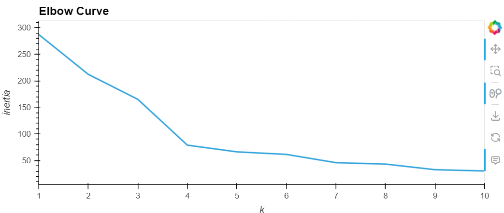
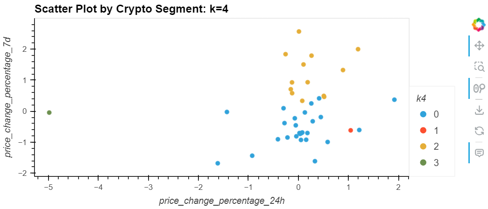

# CryptoClustering - Module 19 Challenge

## Overview
The goal of this challenge was to employ techniques for unsupervised machine learning to find the best values for the given set of data. The objectives were:
1. Find the best k value by using the original data
2. Cluster the cryptocurrencies with K-means by using the original data
3. Optimize clusters with Principal Component Analysis (PCA)
4. Find the best k value by using the PCA data
5. Cluster the cryptocurrencies with K-means by using the PCA data
6. Visualize and compare the results of using the original data vs the PCA data
--------------------------------
## 1. Find the Best Value for k by Using the Original Data
**Synopsis: K values/KMeans is a method of analyzing data by clustering groups of data based on similarities, where k is the number of distinct clusters and each data point is assigned to the closest cluster.**

The first step to analyzing the data was to import the CSV data, get an idea of what the data looks like, and then use the .describe() function to see the summary statistics. The next step was to prepare the data by using the StandardScaler().fit_transform() function on columns containing numerical values (in this project it was all of the price_change_percentage columns). Once the data was scaled, I made a list of k values (range 1-11) and an empty list for storing inertia values. After I initialized the lists, I used a for loop to iterate through each k value and fit a model to it, and stored the data in the inertia list. What this does is segment the data and simplify it to where a simple line chart (elbow curve) can be generated and analyzed to see where the most prominent change (i.e. the elbow) in data is before the line segments flatten and have little to no change. 

In order to create the elbow curve I needed to create a dictionary with the k values and inertia values generated in the for loop and transform it into a dataframe. Using pandas hvplot, I generated the elbow curve where x was the k values and y was the inertia values. For this first elbow curve, seen below in figure 1, the last significant change is at k = 4, which means that it is the best k value for this dataset.

Fig. 1, Elbow curve using original data

---------------------------------
2. Cluster the Cryptocurrencies with K-Means by Using the Original Data

The next for step k-means was to cluster k = 4 by using the original scaled data to fit it to a model. The model is defined as having n_clusters = 4 and random_state = 1. Using this model allowed me to predict which cluster each data point would fall in (found in the k4 column of crypto_predictions_df). Once I had the predictions, I used hvplot to create a scatter plot that showed each cryptocoin and which cluster it was predicted to reside in. The scatter plot uses "price_change_percentage_24h" as the x-axis and "price_change_percentage_7d" as the y-axis, and the clusters from the k4 column are shown by color, see figure 2 below.

Fig. 2, Scatter Plot by Crypto Segment: k = 4.

------------------------------
3. Optimize the Clusters with Principal Component Analysis

**Synopsis: Principal Component Analysis (PCA) is a method where a large data set is reduced into a smaller set of variables, i.e. the original large set of values, or variables, is condensed to a smaller set of variables that are mixtures of the original variables, but still contain most of the information from the large set. This makes the dataset easier to handle and is faster for machine learning, but does come with the caveat that some accuracy is lost in the process.**

This assignment required using PCA to optimize the clusters and determine if the best k value from a PCA standpoint matches the k value that was determined with the original data. First the pca was assigned n_components = 3, then used the pca.fit_transform() function on the crypto_scaled_df to generate the PCA data. This data was used to find the explained_variance_. The explained_variance_ is what allows a data scientist to determine the amount of variance explained by each of the components.

Create a PCA model instance, and set n_components=3. (1 point)

Use the PCA model to reduce the features to three principal components. Then review the first five rows of the DataFrame. (2 points)

Get the explained variance to determine how much information can be attributed to each principal component. (2 points)

Answer the following question: What’s the total explained variance of the three principal components? (3 points)

Create a new DataFrame with the PCA data. Be sure to set the coin_id index from the original DataFrame as the index for the new DataFrame. Review the resulting DataFrame. (2 points)
---------------------------------
4. Find the Best Value for k by Using the PCA Data (10 points)
To receive all points, you must:

Code the elbow method algorithm, and use the PCA data to find the best value for k. Use a range from 1 to 11. (2 points)

To visually identify the optimal value for k, plot a line chart of all the inertia values computed with the different values of k. (5 points)

Answer the following questions: What’s the best value for k when using the PCA data? Does it differ from the best value for k that you found by using the original data? (3 points)
---------------------------------
5. Cluster the Cryptocurrencies with K-means by Using the PCA Data (10 points)
To receive all points, you must:

Initialize the K-means model with four clusters by using the best value for k. (1 point)

Fit the K-means model by using the PCA data. (1 point)

Predict the clusters for grouping the cryptocurrencies by using the PCA data. Review the resulting array of cluster values. (3 points)

Create a copy of the DataFrame with the PCA data, and then add a new column to store the predicted clusters. (1 point)

Using hvPlot, create a scatter plot by setting x="PC1" and y="PC2". Color the graph points with the labels that you found by using K-means. Then add the crypto name to the hover_cols parameter to identify the cryptocurrency that each data point represents. (4 points)
-------------------------------
6. Visualize and Compare the Results (15 points)
To receive all points, you must:

Create a composite plot by using hvPlot and the plus sign (+) operator to compare the elbow curve that you created from the original data with the one that you created from the PCA data. (5 points)

Create a composite plot by using hvPlot and the plus (+) operator to compare the cryptocurrency clusters that resulted from using the original data with those that resulted from the PCA data. (5 points)

Answer the following question: Based on visually analyzing the cluster analysis results, what’s the impact of using fewer features to cluster the data by using K-means? (5 points)

## Resources
- Xpert Learning Assistant
- Module 19 activities, particularly 19.3 activity 04
- #ask-your-class channel in Slack
- https://towardsdatascience.com/understanding-k-means-clustering-in-machine-learning-6a6e67336aa1
- https://builtin.com/data-science/step-step-explanation-principal-component-analysis
- https://stackoverflow.com/questions/57293716/sklearn-pca-explained-variance-and-explained-variance-ratio-difference

